# SpectrumPY-Flight

> Ground-system decoding, fitting, and visualization tools for the LASP/IMPACT IDEX campaign.



## Table of contents

1. [Overview](#overview)
2. [Quickstart](#quickstart)
3. [Launching the Quicklook GUI](#launching-the-quicklook-gui)
4. [Exploring the interface](#exploring-the-interface)
5. [Automation & analysis pipelines](#automation--analysis-pipelines)
6. [Repository layout](#repository-layout)
7. [Troubleshooting](#troubleshooting)
8. [Documentation library](#documentation-library)

## Overview

SpectrumPY-Flight bundles every tool the IDEX team used during the flight-model integration campaign: packet decoders, Rice decompression, HDF5/CDF exporters, matplotlib quicklooks, oscilloscope processors, and science analytics notebooks. The flagship `IDEX-quicklook.py` GUI stitches these capabilities together so analysts can load telemetry, compare fits, and export publication-ready plots in seconds.【F:IDEX-quicklook.py†L1025-L1323】【F:lmfit_idex_packet.py†L46-L200】【F:idex_packet.py†L203-L376】

### Highlights

* **Robust decoding pipelines** – Translate raw XTCE telemetry into structured HDF5/CDF science products, with optional lmfit-based curve fitting and derived metadata.【F:lmfit_idex_packet.py†L46-L377】【F:science_tool.py†L60-L377】
* **Polished GUI experience** – Quickload HDF5/CDF files, toggle channels, inspect fit overlays, and export plots directly from a modernized Qt interface.【F:IDEX-quicklook.py†L1056-L1323】
* **Self-serve documentation** – Launch an in-app documentation center, search every Markdown guide, and follow curated tutorials without leaving the viewer.【F:IDEX-quicklook.py†L200-L409】【F:docs/quicklook_tutorial.md†L1-L91】
* **Automation scripts** – Batch decode telemetry, run calibration sweeps, and post-process oscilloscope campaigns with turnkey shell helpers.【F:process_packets.sh†L1-L27】【F:process_EM_Data.sh†L1-L37】【F:analyze_velocities.sh†L1-L18】

## Quickstart

### Prerequisites

* Python 3.10 and the mission packet definition `idex_combined_science_definition.xml`.【F:science_tool.py†L1-L79】
* Scientific Python stack: NumPy, SciPy, matplotlib, pandas, seaborn, h5py, lmfit, bitstring, cdflib, and a Qt binding (PySide6 or PyQt6).【F:lmfit_idex_packet.py†L12-L200】【F:HDF_View.py†L60-L163】
* Optional GUI helpers for HDF5/CDF browsing (`HDF_View.py`, `CDF_View.py`) and plot dashboards (`HDF_Explorer.py`).【F:HDF_View.py†L60-L398】【F:CDF_View.py†L87-L324】【F:HDF_Explorer.py†L24-L536】

### Environment setup

1. Create an isolated environment and install dependencies:
   ```bash
   conda create -n spectrum_py python=3.10
   conda activate spectrum_py
   pip install numpy scipy matplotlib pandas seaborn h5py lmfit bitstring cdflib pyqt6
   ```
2. Add the repository root to `PYTHONPATH` (or run tools from the repo root) so relative imports resolve.
3. Ensure the canonical folders exist: `Data/`, `HDF5/`, `CDF/`, `Plots/`, and `output_from_ois/`. Batch scripts expect these directories when decoding telemetry and exporting plots.【F:ImpactBook.py†L124-L143】【F:combine_target_signals.py†L30-L149】

### Sample workflow

1. **Capture telemetry** using `read_from_ois.py` to record raw socket streams from GS-OASIS into timestamped binary dumps.【F:read_from_ois.py†L1-L43】
2. **Decode and fit events** with `lmfit_idex_packet.py` or `science_tool.py`, producing per-event HDF5 datasets and optional CDF exports.【F:lmfit_idex_packet.py†L46-L377】【F:science_tool.py†L60-L377】
3. **Inspect results** inside the Quicklook GUI, open the documentation center for guidance, and export polished plots for collaboration.【F:IDEX-quicklook.py†L1056-L1323】

## Launching the Quicklook GUI

* Launch the new welcome screen with `python spectrum_launcher.py` to choose a data file, start mode, and jump into either the HDF Plotter or the full IDEX Quicklook interface.【F:spectrum_launcher.py†L21-L198】
* Prefer `python -m imfpy.gui.main` when SpectrumPY is installed as a package—the command adds the repository to `PYTHONPATH` automatically and mirrors the welcome screen launcher. Use `python -m imfpy.gui.main quicklook --filename <file.h5>` to jump straight into the viewer with an optional dataset pre-selected.【F:imfpy/gui/main.py†L8-L129】
* Run `python IDEX-quicklook.py` from the repository root. Pass `--filename <file.h5>` (and optionally `--eventnumber N`) to pre-load a dataset.【F:IDEX-quicklook.py†L1585-L1595】
* The universal Open dialog remembers the best starting folder: HDF5 files default to `HDF5/` while the **Open CDF…** shortcut jumps straight into the `CDF/` directory for exported products.【F:IDEX-quicklook.py†L82-L120】
* Press `Ctrl+R` to reload a file after re-running fits; channel selections and overrides remain intact.【F:IDEX-quicklook.py†L1058-L1323】

## Exploring the interface

### Toolbar & navigation

* The toolbar consolidates open/reload commands, export menu, a dedicated help button, and the event selector. Buttons use higher-contrast styling for readability, and the question-mark action opens the documentation center (`F1`).【F:IDEX-quicklook.py†L1216-L1294】
* Status tips and shortcuts surface throughout the menu bar (`File`, `Edit`, `View`, `Help`). A built-in search bar lives inside the `Help` menu so you can jump to documentation without leaving the keyboard.【F:IDEX-quicklook.py†L1134-L1192】

### Channel & fit controls

* Channel toggles and overlay buttons share a modernized palette with indigo highlights when active. Fit overlays can be toggled per-channel, and the `Edit Fit Parameters` button opens the override dialog for precise tuning.【F:IDEX-quicklook.py†L1296-L1349】【F:IDEX-quicklook.py†L1370-L1587】
* Use `Reset Fit Overrides` from the toolbar or `Edit` menu to restore the on-disk solution after experimentation.【F:IDEX-quicklook.py†L1056-L1188】

### Built-in help & search

* The new `DocumentationCenter` aggregates the README and every Markdown guide into a searchable library. It renders content in-place, highlights matches, and keeps navigation history in a split-pane viewer.【F:IDEX-quicklook.py†L200-L409】
* `Help → Search documentation…` activates the same search dialog, and the toolbar help button mirrors the `F1` shortcut so assistance is one click away.【F:IDEX-quicklook.py†L1134-L1192】
* The curated [Quicklook Tutorial](docs/quicklook_tutorial.md) complements the in-app help with a step-by-step workflow for analysts joining the project.【F:docs/quicklook_tutorial.md†L1-L91】

## Automation & analysis pipelines

* `process_packets.sh` watches `Data/` for new binary dumps, runs the lmfit decoder, and writes cleaned products into `HDF5/`.【F:process_packets.sh†L1-L27】
* `process_EM_Data.sh` orchestrates oscilloscope calibration sweeps, invoking `ImpactBook.py` for every trace directory and capturing plots/CSVs.【F:process_EM_Data.sh†L1-L37】【F:ImpactBook.py†L120-L609】
* `analyze_velocities.sh` and `qd_quicklook.py` deliver quick assessments for accelerator campaigns and target/QD fits.【F:analyze_velocities.sh†L1-L18】【F:qd_quicklook.py†L43-L878】
* `HDF_Explorer.py` builds multi-file scatter dashboards for analysis groups, while `HDF_View.py` and `CDF_View.py` provide lightweight structure browsers.【F:HDF_Explorer.py†L24-L536】【F:HDF_View.py†L60-L398】【F:CDF_View.py†L87-L324】

## Repository layout

| Path | Purpose |
| ---- | ------- |
| `Data/` | Telemetry staging area for raw binary captures.| 
| `HDF5/` | Primary output folder for decoded quicklook products.| 
| `CDF/` | Generated CDF files accessible via the `Open CDF…` shortcut.| 
| `Plots/` | Destination for exported quicklook figures and batch plots.| 
| `docs/` | Markdown guides, including the quicklook tutorial and technical memos.| 
| `ImpactBook.py`, `qd_quicklook.py` | Oscilloscope processing pipelines with fit/SQL integration.【F:ImpactBook.py†L120-L609】【F:qd_quicklook.py†L43-L878】 |
| `science_tool.py`, `lmfit_idex_packet.py` | Legacy and lmfit-based science decoders for packet ingest.【F:science_tool.py†L60-L377】【F:lmfit_idex_packet.py†L46-L377】 |

## Troubleshooting

* **Missing dependencies** – Install `h5py` and `cdflib` when the GUI reports missing optional modules. CLI decoders depend on `bitstring` and `lmfit` for waveform parsing and fits.【F:lmfit_idex_packet.py†L12-L200】【F:idex_packet.py†L34-L201】
* **Headless systems** – Wrap GUI launches with `xvfb-run python IDEX-quicklook.py` to provide a virtual display server on CI or remote nodes.【F:IDEX-quicklook.py†L1585-L1595】
* **Unexpected fit curves** – Use the fit parameter dialog to review overrides, then click `Reset Fit Overrides` or restart the viewer to reload on-disk parameters.【F:IDEX-quicklook.py†L1056-L1188】
* **Scatter click tools not launching Quicklook** – Confirm matplotlib is emitting pick events and gather the diagnostics listed in [Debugging the interactive clicking tools](docs/clicking_tools_support.md) before filing an issue. The log lines printed inside `HDF_Explorer.py`'s click handler indicate whether the selection fired.【F:docs/clicking_tools_support.md†L1-L38】【F:HDF_Explorer.py†L478-L526】

## Documentation library

The repository ships with a comprehensive Markdown knowledge base accessible from within the application:

* **README (this page)** – Mission overview, setup instructions, and navigation tips.
* **Quicklook Tutorial** – Deep dive on GUI workflows and shortcuts.【F:docs/quicklook_tutorial.md†L1-L91】
* **L2A CDF Guides** – Detailed comparisons between ASCII scans and HDF/CDF exports for downstream processing.【F:docs/l2a_cdf_ascii_scan.md†L1-L75】【F:docs/l2a_cdf_vs_hdf.md†L1-L83】

Launch the documentation center (`F1`) at any time to browse, search, and cross-reference these guides directly inside the application.【F:IDEX-quicklook.py†L200-L409】
