# SpectrumPY Quicklook Tutorial

The refreshed IDEX Quicklook application takes you from raw HDF5/CDF science
products to annotated plots in a few clicks. This expanded tutorial explains how
to launch the tooling (source checkout, packaged app, or CI build), highlights
the Spectrum Launcher welcome screen, and walks through the Quicklook interface
in detail.

## 1. Launching SpectrumPY

### 1.1 Choose your entry point

* **Packaged desktop build.** Double-click the SpectrumPY bundle created with
  PyInstaller (`IDEX-Quicklook.app`, `IDEX-Quicklook.exe`, or `IDEX-Quicklook`).
  Every platform launches the `spectrum_launcher` welcome screen so you can pick
  a data product before entering the viewer.【F:spectrum_launcher.py†L167-L289】
* **Source checkout (recommended for developers).** From the repository root run
  `python start.py` to execute the lightweight wrapper that forwards directly to
  the Spectrum Launcher’s `main()` function.【F:start.py†L1-L7】
* **Direct module invocation.** Use `python spectrum_launcher.py` to skip the
  wrapper or `python IDEX-quicklook.py --filename <file>` when you want to bypass
  the welcome screen entirely.【F:spectrum_launcher.py†L281-L293】【F:IDEX-quicklook.py†L1585-L1595】

### 1.2 Spectrum Launcher orientation

The welcome window introduces mission branding, prompts you to choose a science
file, and exposes shortcuts to the HDF Plotter and full Quicklook GUI.

1. Click **Browse…** to select `.h5`, `.hdf5`, `.cdf`, or `.trc` files. The file
   dialog defaults to the `HDF5/` directory (if present) and falls back to the
   repository root.【F:spectrum_launcher.py†L220-L247】
2. Once a file is selected the launcher enables the **Open in HDF Plotter**
   button for HDF5 products and **Open in IDEX Quicklook** for every supported
   extension.【F:spectrum_launcher.py†L196-L274】
3. Launchers keep running while child windows are open, so you can inspect
   multiple datasets during the same session. Closing a viewer returns you to the
   welcome window.【F:spectrum_launcher.py†L249-L279】

### 1.3 Preparing your environment

1. Activate your Python environment with GUI dependencies. The
   `spectrumpy[quicklook]` extra installs PySide6, qtawesome, and the SQL adapters
   in one step; add `pyqt` to the extras list if you prefer those bindings.
2. Ensure the mission directory structure exists: `Data/`, `HDF5/`, `CDF/`, and
   `Plots/`. Automation scripts and the launcher expect these folders when
   opening dialogs and exporting results.【F:ImpactBook.py†L124-L143】【F:combine_target_signals.py†L30-L149】
3. Run `python -m imfpy.gui.main` if SpectrumPY is installed as a package. The
   module exposes identical CLI flags and subcommands for launching Quicklook
   directly or scripting a pre-selected dataset.【F:imfpy/gui/main.py†L8-L129】

## 2. Opening HDF5 and CDF products

* **Open…** (toolbar or `File → Open…`) provides a unified dialog for HDF5/CDF
  inputs. The helper defaults to the repository’s `HDF5/` directory the first
  time you launch it.【F:IDEX-quicklook.py†L82-L120】
* **Open CDF…** starts the chooser in the `CDF/` directory so you can jump
  straight to exported Common Data Format products without re-navigating.
* Use **Reload** after running a new decode or fit cycle; the viewer rereads the
  active file and refreshes plots without rebuilding channel selections.【F:IDEX-quicklook.py†L1056-L1188】

## 3. Navigating events

* The event selector lives on the right side of the toolbar. Scroll or use the
  arrow keys to move through events; the status bar updates with the event number
  and timestamp metadata when available.【F:IDEX-quicklook.py†L1216-L1294】
* Use **Open Data Browser** to launch the contextual CDF/HDF structure viewers in
  parallel windows when you need to inspect attributes or raw tables.

## 4. Channel toggles and overlays

* The toggle panel groups every waveform by detector. Buttons glow indigo when
  active, giving you immediate feedback on what is plotted.【F:IDEX-quicklook.py†L1296-L1349】
* Enable **Overlay same time axis** to draw the selected channels against the
  same x-axis when their sampling rate aligns.
* Toggle **Show Ion Grid Fit**, **Show Target L Fit**, and related buttons to
  display calculated EMG/ion-grid fits alongside raw traces.
* `Edit Fit Parameters` opens an interactive dialog where you can tweak fit
  coefficients, apply overrides, and revert to the on-disk solution.【F:IDEX-quicklook.py†L1370-L1587】

## 5. Plotting canvas

* Each channel renders on its own axis within a synchronized matplotlib canvas.
  Interact with the embedded navigation toolbar to zoom, pan, or export views.
* The **Export Plot** button exposes PNG/PDF/SVG exports. File names incorporate
  the event number, making it easy to archive comparisons.

## 6. Noise analysis window

The toolbar and `View` menu expose a dedicated **Noise Analysis** workspace for
the currently loaded event (`Ctrl+N`).【F:IDEX-quicklook.py†L1972-L2026】【F:IDEX-quicklook.py†L2068-L2142】
Launching it opens an auxiliary window that focuses on three diagnostics for the
selected channel:

* **Amplitude histogram with Gaussian overlay.** The window automatically fits a
  normal distribution to the noise-only samples and overlays it on the
  histogram so you can verify whether the tails are Gaussian or contaminated by
  coherent pickup.【F:noise_analysis.py†L270-L331】
* **Power spectrum.** A detrended FFT reveals narrowband tones and broadband
  energy at a glance. The tool infers the sample spacing from the dataset’s
  timestamp array so the x-axis is expressed in physical frequency when
  possible.【F:noise_analysis.py†L333-L360】
* **Autocorrelation.** The normalized autocorrelation plot highlights
  persistence and periodicity in the residual noise. When timing metadata is
  available the x-axis switches to physical lag units, making it easy to link
  peaks back to instrument oscillators.【F:noise_analysis.py†L362-L402】

Summary tiles underneath the plots report the Gaussian mean, σ, fitted peak
amplitude, Poisson noise estimate, and RMS noise, while the status bar confirms
sample counts and the inferred Δt. Channel units, event lists, and cached
datasets travel with the window, so switching channels or stepping through
events refreshes the plots without reloading from disk.【F:noise_analysis.py†L55-L221】【F:noise_analysis.py†L402-L451】 The
analysis gracefully handles empty or missing channels by clearing the plots and
status text until a populated waveform is selected.【F:noise_analysis.py†L304-L324】

## 7. Dust composition & mass line shapes

Use the **Dust Composition** button (`Ctrl+D`) to launch the composition
workspace, which combines high-/medium-/low-gain TOF traces, handles baseline
subtraction, and lets you fit analytic mass lines before exporting abundance
tables.【F:IDEX-quicklook.py†L2068-L2142】【F:dust_composition.py†L3008-L3123】 Each
mass line can be refit or inspected in detail via the **Inspect Mass Line**
dialog. The inspector offers a shape selector backed by the shared
`line_shapes.py` library, so you can swap between EMG, Gaussian, Lorentzian,
Voigt, double EMG, HyperEMG, and generalised-normal profiles without leaving
the window.【F:dust_composition.py†L1387-L1478】【F:line_shapes.py†L17-L126】 Shape
changes automatically update parameter labels (for example switching `σ` to
`γ` for Lorentzian fits) and expose extra controls such as secondary time
constants or weight lists for composite tails.【F:dust_composition.py†L1387-L1478】

**Mass line palette from the inspector**

* Gaussian — center, σ, and amplitude controls for symmetric peaks.
* Lorentzian — centre/γ parameters for sharp resonance-like lines.
* Voigt — combines Gaussian σ and Lorentzian γ to capture blended spreads.
* EMG and double EMG — skewed exponential tails for asymmetric TOF arrivals.
* HyperEMG and generalised-normal — composite tails and flexible kurtosis for
  complex dust populations.

The dialog plots the candidate waveform, overlays the fitted curve, and updates
relative abundance estimates based on the analytic area under each line window.
Abundances are normalised against the integrated, baseline-subtracted TOF trace
so you can compare species contributions across events.【F:dust_composition.py†L3208-L3295】【F:dust_composition.py†L3336-L3361】
Enable **Relative Sensitivity Factors…** to renormalise selected lines, review
auto-ranked material matches, and project compositions on the ternary explorer
without leaving the workspace.【F:dust_composition.py†L3008-L3525】【F:dust_composition.py†L3526-L4023】 Exported tables persist the
fitted parameters, analytic areas, RSF selections, and abundance fractions
alongside any manually assigned species labels for downstream mass
budgeting.【F:dust_composition.py†L3438-L3484】【F:dust_composition.py†L3828-L4023】

## 8. Built-in help & documentation search

* Click the question-mark **Help** button or press `F1` to launch the
  Documentation Center. It lists every bundled guide (README, tutorials,
  technical memos) and renders their content inline.【F:IDEX-quicklook.py†L200-L409】
* Use the search bar at the top of the help window to search across all Markdown
  files. Results show the file name, line number, and a short snippet; selecting
  a match jumps the reader to that location.
* The menu bar also includes a quick search widget under `Help` so you can start
  typing without leaving the main window.【F:IDEX-quicklook.py†L1134-L1192】

## 9. Keyboard shortcuts

| Shortcut | Action |
| -------- | ------ |
| `Ctrl+O` | Open any supported file |
| `Ctrl+R` | Reload the current file |
| `Ctrl+B` | Open the contextual data browser |
| `Ctrl+E` | Launch the fit parameter editor |
| `Ctrl+F1` | Focus the documentation search bar |
| `F1` | Open the documentation center |
| `Ctrl+Q` | Quit the application |

## 10. Troubleshooting tips

* If the viewer reports that `cdflib` or `h5py` is missing, install the optional
  dependency in your environment (`pip install cdflib h5py`).
* The UI requires a display server. On headless Linux nodes use
  `xvfb-run python IDEX-quicklook.py` to virtualize an X server.【F:IDEX-quicklook.py†L1585-L1595】
* When the fit overlay diverges from expectations, use **Reset Fit Overrides** to
  discard cached tweaks. The status bar confirms when overrides have been
  cleared.【F:IDEX-quicklook.py†L1056-L1188】

---

For a deeper dive into the science pipelines, packet decoders, and automation
scripts, see the project [README](../README.md) and the documentation index
surfaced by the in-app help center.
